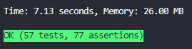

<p align="center"><a target="_blank" href="https://matheus.sgomes.dev"></a></>


👤 **Matheus S. Gomes** 

* Website: https://matheus.sgomes.dev
* Github: [@Matheussg42](https://github.com/Matheussg42)
* LinkedIn: [@matheussg](https://linkedin.com/in/matheussg)

---

<p align="center">

</p>

<p align="center">
   
  
  
  
   
  
  
</p>

<p align="center">
  <a href="https://github.com/Matheussg42/pts_FinancialManagement">Home</a>&nbsp;&nbsp;&nbsp;|&nbsp;&nbsp;&nbsp;
  <a href="/backend">Back-end</a>&nbsp;&nbsp;&nbsp;|&nbsp;&nbsp;&nbsp;
  <a href="/frontend">Front-end</a>&nbsp;&nbsp;&nbsp;|&nbsp;&nbsp;&nbsp;
  <a href="https://apidoc.sgomes.dev/Projetos/FinancialManagement/index.php" target="_blank">APIDoc</a>
</p>

#### Nesta Página:

* [Projeto](#projeto)
* [Configuração](#config)
* [Instalando dependências](#dependencias)
* [Subindo a aplicação](#aplicacao)
* [Endpoints](#endpoints)
* [Testes](#testes)

<span id="projeto"></span>
## Projeto

O Financial Management é um projeto feito para treinar o conhecimento nas tecnologias citadas a cima. Neste projeto, foi desenvolvido um gerenciador financeiro, com a possibilidade de inserir os valores recebidos e pagos por mês. Possuindo Registro e Login para separarmos o controle financeiro por usuário.

<span id="config"></span>
## Configuração

Acesse a raiz da pasta `backend`, é necessário criar o `.env` do projeto, e para isso, crie uma copia ou renomeie o arquivo `.env-dist`. O próximo passo é a criação de um novo Banco de Dados para o projeto. O nome do banco deve ser informado na linha `DB_DATABASE=` do `.env`.

<span id="dependencias"></span>
## Instalando dependências

Acesse a raiz da pasta `backend` pelo _terminal_, e instale as dependências usando o comando `composer`.

```php
composer install
```

<span id="aplicacao"></span>
## Subindo a aplicação

Acesse a raiz da pasta `backend` pelo _terminal_, digite os comandos:

```php
php artisan key:generate
```
Para gerar a chave do projeto.

```php
php artisan migrate
```
Para criar as tabelas utilizadas no projeto.

```php
php artisan migrate:refresh --seed
```
Para criar as tabelas utilizadas no projeto, já com registros.

```php
php artisan serve
```
Para iniciar o Back-end do projeto.

<span id="endpoints"></span>
## Endpoints

A documentação dos Endpoints foi gerada e esta disponível para consultas neste link.

https://apidoc.sgomes.dev/Projetos/FinancialManagement/index.php

<span id="teste"></span>
## Testes

O projeto foi criado com testes Unitários e de Integrações.
Para executar os testes, acesse a raiz da pasta `backend` pelo _terminal_, digite os comandos:

```php
vendor/bin/phpunit
```

