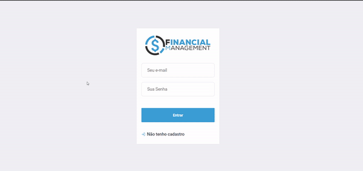
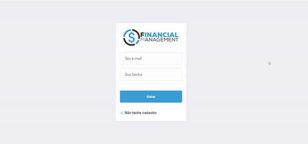
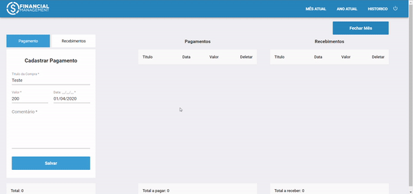
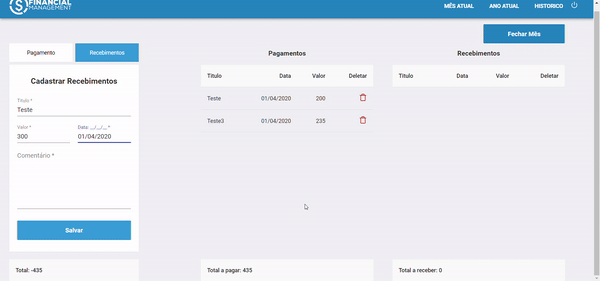
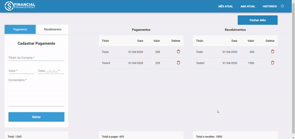
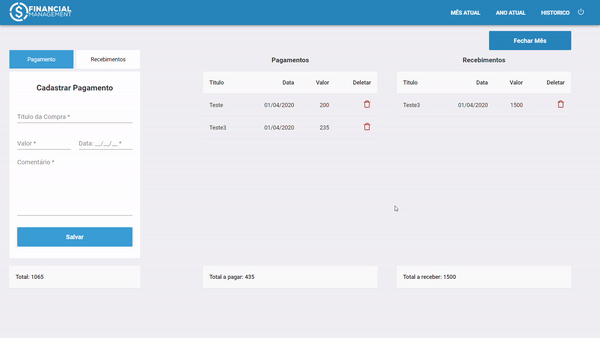

<p align="center"><a target="_blank" href="https://matheus.sgomes.dev"></a></>


👤 **Matheus S. Gomes** 

* Website: https://matheus.sgomes.dev
* Github: [@Matheussg42](https://github.com/Matheussg42)
* LinkedIn: [@matheussg](https://linkedin.com/in/matheussg)

---

<p align="center">

</p>

<p align="center">

   
  
  
  
   
  
  
</p>

<p align="center">
  <a href="https://github.com/Matheussg42/pts_FinancialManagement">Home</a>&nbsp;&nbsp;&nbsp;|&nbsp;&nbsp;&nbsp;
  <a href="/backend">Back-end</a>&nbsp;&nbsp;&nbsp;|&nbsp;&nbsp;&nbsp;
  <a href="/frontend">Front-end</a>&nbsp;&nbsp;&nbsp;|&nbsp;&nbsp;&nbsp;
  <a href="https://apidoc.sgomes.dev/Projetos/FinancialManagement/index.php" target="_blank">APIDoc</a>
</p>

#### Nesta Página:

* [Projeto](#projeto)
* [Instalando dependências](#dependencias)
* [Subindo a aplicação](#aplicacao)
* [Telas](#telas)

<span id="projeto"></span>
## Projeto

O Financial Management é um projeto feito para treinar o conhecimento nas tecnologias citadas a cima. Neste projeto, foi desenvolvido um gerenciador financeiro, com a possibilidade de inserir os valores recebidos e pagos por mês. Possuindo Registro e Login para separarmos o controle financeiro por usuário.

<span id="dependencias"></span>
## Instalando dependências

Acesse a raiz da pasta `frontend` pelo _terminal_, e instale as dependências usando o comando `yarn`, ou `npm`.

```js
yarn install
```

```js
npm install
```

<span id="aplicacao"></span>
## Subindo a aplicação

Acesse a raiz da pasta `frontend` pelo _terminal_, digite o comando `yarn start`.

```js
yarn start
```

<span id="telas"></span>
## Telas

#### Usuário

* Cadastro de Usuário
* Login





#### Financeiro

* Abrir Mês
* Cadastro de Pagamento
* Cadastro de Recebimento
* Listar Movimentação Financeira
* Fechar Mês





#### Ano

* Listar Movimentações do Ano atual
* Fechar Mês



#### Histórico

* Listar Movimentações dos meses por ano
* Fechar Mês

